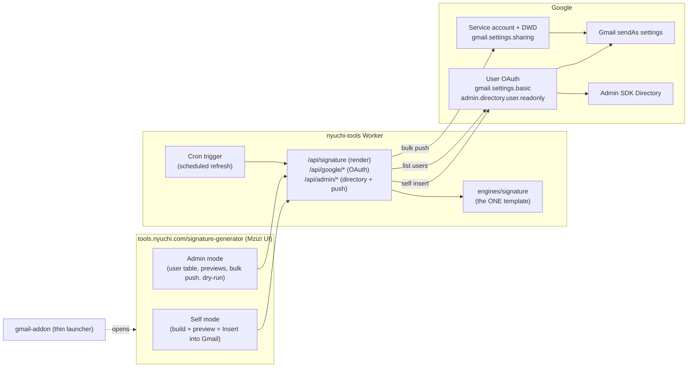

# Signature Console — unification plan

**Status: PROPOSED** (approved direction: Worker-native console; this doc is the review artifact — no code lands until it's signed off).

**Who:** Bryan approves the architecture and performs the Google-side setup (§5); agents implement phase by phase, each phase its own PR with the full verify/review/docs-sync process.
**What:** merge the three signature surfaces — the web Signature Generator, the Gmail add-on, and the `email-signature` batch script — into **one console at tools.nyuchi.com**, powered by **one engine**, with real orchestration: insert into your own Gmail directly, and (as admin) pull every domain user, generate all signatures, and push them back.
**Why:** today the signature template exists in **three hand-synced copies** (web engine, `gmail-addon/Code.js`, `email-signature/Code.js`) and admin push exists in **two overlapping implementations**; the add-on's CardService UI cannot carry the Mzizi design language; users copy-paste HTML by hand.
**Where:** the console lives at `/signature-generator` (grown, not moved); execution lives in the `nyuchi-tools` Worker; Google-side trust lives in a service account with domain-wide delegation.
**When:** after PR #41 lands, in the phase order below — each phase is independently shippable.

## 1. Current state (what we're unifying)

| Surface | Template copy | Can push to Gmail? | UI |
|---|---|---|---|
| Web `/signature-generator` | canonical engine (`engines/signature`) | no — clipboard only | Mzizi (React island) |
| `gmail-addon` (User tab) | 2nd copy (`generateUserSignatureHtml`) | own mailbox (`gmail.settings.basic`) | CardService (unstylable) |
| `gmail-addon` (Admin tab + Dashboard.html) | 2nd copy | all users (`gmail.settings.sharing` via DWD) | CardService + 1,700-line bespoke HTML |
| `email-signature` script | 3rd copy (`generateSignatureHtml`) | all users **+ aliases** | none (script editor) |

The emitted signature HTML is byte-locked to the historical design; **unification must not change the emitted markup** — the engine remains the single authority and the other copies are retired, not re-synced.

## 2. Target architecture

Key properties:
- **One engine.** Every surface renders through `engines/signature` — the Worker exposes it as an API so nothing ever hand-syncs a template again.
- **Two trust paths, matching today's model.** Self-service acts as the signed-in user (OAuth, least privilege). Bulk admin push uses a service account with domain-wide delegation — the same mechanism the Apps Script admin flows already require, just held by the Worker instead.
- **Humans in the loop** (Mzizi doctrine): admin bulk push always previews first, supports dry-run, and reports per-user success/failure; failures can be filed through the existing `report_issue` loop.

## 3. Phases

### Phase 0 — one engine everywhere (small; no Google setup)
- Add `POST /api/signature` to the Worker: signature params in, byte-locked HTML out (same code path as the MCP tool; requires the site session or a bearer token — never open).
- Point both Apps Script projects at it (`UrlFetchApp`), deleting their template functions. Behavior identical; drift impossible.
- Acceptance: Apps Script `runAllTests()` passes with fetched HTML byte-equal to engine output; worker tests cover the endpoint.

### Phase 1 — orchestration
- **Google OAuth in the Worker** (`/api/google/login`, `/callback`): authorization code flow with incremental scopes; tokens held server-side in a session, never exposed to the page.
- **Self mode:** "Insert into Gmail" writes the generated signature to the user's own send-as (`gmail.settings.basic`). Clipboard copy remains as fallback.
- **Admin mode:** list users + send-as aliases (`admin.directory.user.readonly`, auto-deriving brand/division from email domain like the batch script does), generate previews for all, push selected/all via the service account (`gmail.settings.sharing`), covering **aliases** to preserve the batch script's superpower.
- **Scheduled refresh:** Worker cron trigger replaces the Apps Script daily trigger; same dry-run/report semantics.
- Acceptance: a real end-to-end on the live domain — one self insert, one single-user admin push, one dry-run-all — verified in Gmail.

### Phase 2 — UX/UI uplift (Mzizi)
- Rebuild the console page on the Mzizi shell: mode switch (Self/Admin), user table with search/filter by division, preview drawer per user, bulk action bar, per-row status (pushed / failed / skipped), progress for long runs, dark/light/accent-consistent semantic tokens, pill controls, 48px touch targets.
- Design authority: query Mzizi for tokens/components; `@bundu/ui` provides the implementation. `studio-qa`-style visual review before ship.

### Phase 3 — retire the old surfaces
- `email-signature` script: delete (its alias handling and scheduling now live in the Worker).
- `gmail-addon`: shrink to a thin sidebar companion — open the console, quick "re-apply my signature" (still valuable inside Gmail); Admin tab and Dashboard.html retire. CardService cannot render Mzizi; the launcher is the honest scope.
- Docs sweep per `docs-sync`; CLAUDE.md's hand-sync rules become historical notes.

## 4. Worker API surface (new)

| Endpoint | Auth | Purpose |
|---|---|---|
| `POST /api/signature` | site session or bearer | Render signature HTML from the engine |
| `GET /api/google/login`, `/api/google/callback` | site session | Google OAuth (incremental scopes) |
| `GET /api/admin/users` | Google session w/ directory scope | List users + aliases + derived brand |
| `POST /api/admin/push` | Google session (admin) + SA | Push signatures (targets, `dryRun`, per-user results) |
| `POST /api/self/insert` | Google session | Write own send-as signature |
| cron trigger | — | Scheduled refresh with report |

## 5. Google-side setup (Bryan, one-time — Phase 1 prerequisite)

1. GCP project (reuse the Apps Script one or create `nyuchi-signature-console`): enable **Gmail API** + **Admin SDK**.
2. OAuth consent screen (internal) + **Web application OAuth client**; redirect URI `https://tools.nyuchi.com/api/google/callback` → `GOOGLE_CLIENT_ID` var, `GOOGLE_CLIENT_SECRET` secret.
3. **Service account** (no key download needed if we use DWD via JWT with a key — practically: create key, store as `GOOGLE_SA_KEY` secret; rotate on a schedule).
4. Admin Console → Security → API controls → **Domain-wide delegation**: authorize the SA's client ID for `https://www.googleapis.com/auth/gmail.settings.sharing` (and `.basic`).
5. `wrangler secret put` for the two secrets; vars for client ID + workspace domain.

## 6. Risks & guardrails

- **Blast radius:** bulk push rewrites every user's signature. Mitigations: dry-run default for "all", per-user preview, per-user result log, and a "restore single user" action; never schedule without an explicit opt-in.
- **Byte-lock:** emitted HTML must remain byte-identical to `engines/signature` output — asserted by tests in Phase 0 before anything else moves.
- **Quotas:** Gmail settings API is per-user rate-limited; bulk runs batch with backoff (the batch script already tolerates this — port its pacing).
- **Secrets:** SA key + OAuth secret follow the existing fail-closed pattern (features off with clear errors until provisioned).
- **Session model:** Google tokens live server-side keyed to the existing `nyuchi_session`; the page never sees them.

## 7. Decision log

- 2026-07-21 — Architecture: **Worker-native console** (over Apps-Script-backend uplift). Plan-doc-first before implementation. Banner removal (#41) precedes this work.
